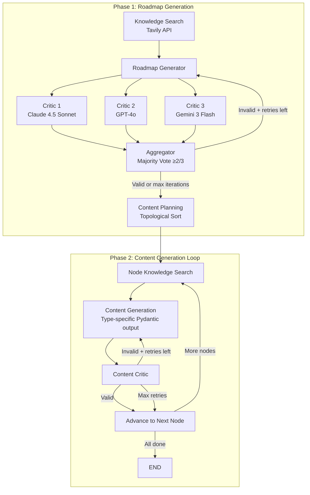

# CourseGen

**AI-Powered Learning Roadmap Generator** — A multi-agent system that generates structured learning roadmaps with pedagogical content, validated by multi-model critic consensus.

## Features

- **Multi-Agent Workflow** — LangGraph orchestrates knowledge search, roadmap generation, content creation, and critic validation as a stateful graph
- **Multi-Model Critic Consensus** — 3 different LLMs (Claude, GPT-4o, Gemini) evaluate roadmaps in parallel; majority vote (≥2/3) required to pass
- **5 Node Types** — Prerequisite, Concept, Pitfall, Comparison, and Practice nodes cover different pedagogical purposes
- **Two-Phase Generation** — Phase 1 builds and validates the DAG structure; Phase 2 generates content per node in topological order
- **Knowledge-Augmented** — Tavily web search provides real-time knowledge for both roadmap design and content generation
- **Interactive DAG Visualization** — Streamlit UI with clickable directed acyclic graph, node detail panels, and progress tracking
- **Persistent Storage** — SQLite (or PostgreSQL) persistence via SQLAlchemy for saving and browsing generation history
- **LLM Observability** — Langfuse integration for tracing all LLM calls, latencies, and token usage

## Architecture Overview



## Tech Stack

| Layer | Technology |
|---|---|
| Orchestration | LangGraph (stateful multi-agent workflow) |
| LLM Abstraction | LangChain + structured outputs via Pydantic |
| LLM Provider | OpenRouter (unified access to Claude, GPT-4o, Gemini) |
| Web Search | Tavily API (advanced depth, raw markdown) |
| Data Validation | Pydantic v2 |
| Web UI | Streamlit + streamlit-agraph (DAG visualization) |
| Database | SQLAlchemy 2.0 + SQLite (default) / PostgreSQL |
| Observability | Langfuse (tracing & monitoring) |
| Package Manager | uv + hatchling |

## Quick Start

### Prerequisites

- Python 3.12+
- [uv](https://docs.astral.sh/uv/) package manager
- OpenRouter API key ([openrouter.ai](https://openrouter.ai))
- Tavily API key (optional, for knowledge search — [tavily.com](https://tavily.com))

### Installation

```bash
# Clone the repository
git clone <repo-url>
cd CourseGen

# Install dependencies
uv sync

# Configure environment variables
cp .env.example .env
# Edit .env with your API keys (at minimum: OPENROUTER_API_KEY)
```

### Run

```bash
uv run streamlit run src/coursegen/ui/app.py
```

## Usage

1. **Enter a topic** — e.g. "Learn React hooks", "Python data science"
2. **Select preferences** — difficulty (Beginner / Intermediate / Advanced), learning goal (Quick Start / Deep Dive), language
3. **Generate** — the system runs the two-phase workflow (~30–60 seconds)
4. **Explore the roadmap** — click nodes on the DAG to view generated content
5. **Track progress** — mark nodes as in-progress or completed
6. **Save** — persist the generation to the database for later review

## 5 Node Types

| Type | Purpose | Content Structure |
|---|---|---|
| **Prerequisite** | Diagnose and fill prior knowledge gaps | `overview`, `checklist` (self-assessment questions), `remediation` (resources for gaps) |
| **Concept** | Build correct mental models through deep explanation | `explanation` (300–600 words), `key_points`, `examples` (with code snippets) |
| **Pitfall** | Warn about common mistakes and debugging traps | `pitfalls` (❌→💡→✅ format), `warning_signs` (symptom → cause) |
| **Comparison** | Clarify confusion between similar concepts/tools | `subject_a`, `subject_b`, `comparison_table` (dimension × A vs B), `when_to_use` |
| **Practice** | Consolidate learning with hands-on tasks | `objective`, `tasks` (progressive subtasks), `expected_output`, `hints` |

## Project Structure

```
CourseGen/
├── src/coursegen/
│   ├── agents/                 # LangGraph node functions
│   │   ├── knowledge_search.py # Tavily search + LLM synthesis
│   │   ├── roadmap.py          # Roadmap generation agent
│   │   ├── critic.py           # 3 parallel critics + majority-vote aggregator
│   │   └── content.py          # Content planning, generation, critic, router
│   ├── prompts/                # LLM prompt templates
│   │   ├── roadmap.py          # Roadmap generation & critic prompts
│   │   ├── content.py          # 5 type-specific content + critic prompts
│   │   └── knowledge_synthesis.py
│   ├── schemas.py              # Pydantic models, enums, LangGraph State
│   ├── workflows/
│   │   └── basic.py            # LangGraph workflow definition (nodes, edges, conditionals)
│   ├── db/                     # Persistence layer
│   │   ├── database.py         # SQLAlchemy engine & session management
│   │   ├── models.py           # GenerationRecord ORM model
│   │   └── crud.py             # Save / list / load / delete operations
│   ├── ui/                     # Streamlit web interface
│   │   ├── app.py              # Main app (sidebar + main content)
│   │   ├── components/
│   │   │   ├── preferences_form.py     # Difficulty / goal / language form
│   │   │   ├── roadmap_visualizer.py   # Interactive DAG (streamlit-agraph)
│   │   │   ├── node_detail.py          # Node metadata + content display
│   │   │   ├── content_renderer.py     # 5 type-specific content renderers
│   │   │   └── history_sidebar.py      # Database history browser
│   │   └── utils/
│   │       └── session_state.py        # Streamlit state init & reset
│   └── utils/
│       └── tavily_search.py
├── data/                       # SQLite database (auto-created)
├── notebook/                   # Jupyter notebooks for testing
├── pyproject.toml
├── uv.lock
└── .env.example
```

## Design Decisions

| Decision | Rationale |
|---|---|
| **Multi-model critics (3 different LLMs)** | Reduces single-model bias; consensus improves reliability |
| **Parallel critic execution** | 3× faster than sequential; LangGraph handles fan-out/fan-in natively |
| **Two-phase workflow** | Validate structure before expensive per-node content generation |
| **Topological content ordering** | Parent content available when generating children; maintains pedagogical coherence |
| **Pydantic structured output** | Type-safe LLM responses; no manual JSON parsing; auto-generated schemas |
| **5 distinct node types** | Each serves a different pedagogical function; typed content ensures consistent quality |
| **OpenRouter as LLM gateway** | Single API key for Claude, GPT-4o, Gemini; easy model swapping |
| **Tavily for knowledge search** | Real-time web data augments LLM knowledge; reduces hallucination |
| **SQLite default + SQLAlchemy** | Zero-config local persistence; swap to PostgreSQL via `DATABASE_URL` |
| **Streamlit** | Rapid prototyping with built-in state management; good enough for MVP |

## Environment Variables

```bash
# Required
OPENROUTER_API_KEY=sk-or-v1-...
BASE_URL=https://openrouter.ai/api/v1

# Model selection (defaults shown)
MODEL_NAME=google/gemini-3-flash-preview
CRITIC_1_MODEL=anthropic/claude-4.5-sonnet
CRITIC_2_MODEL=openai/gpt-4o
CRITIC_3_MODEL=google/gemini-3-flash-preview

# Optional: Tavily web search
TAVILY_KEY=tvly-...

# Optional: Langfuse observability
LANGFUSE_PUBLIC_KEY=pk-lf-...
LANGFUSE_SECRET_KEY=sk-lf-...
LANGFUSE_HOST=https://cloud.langfuse.com

# Optional: Database (defaults to sqlite:///data/coursegen.db)
DATABASE_URL=sqlite:///data/coursegen.db
```

## License

MIT
