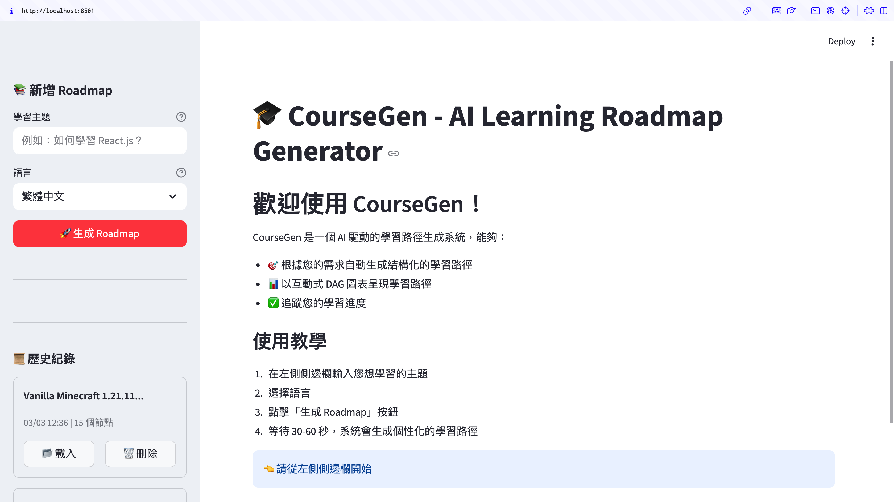
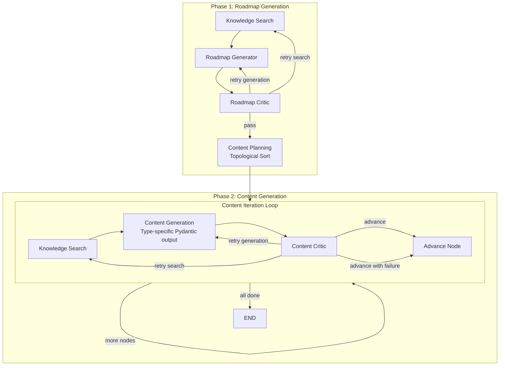
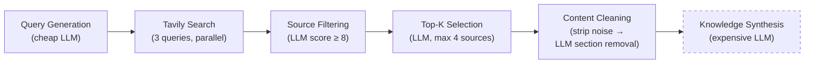
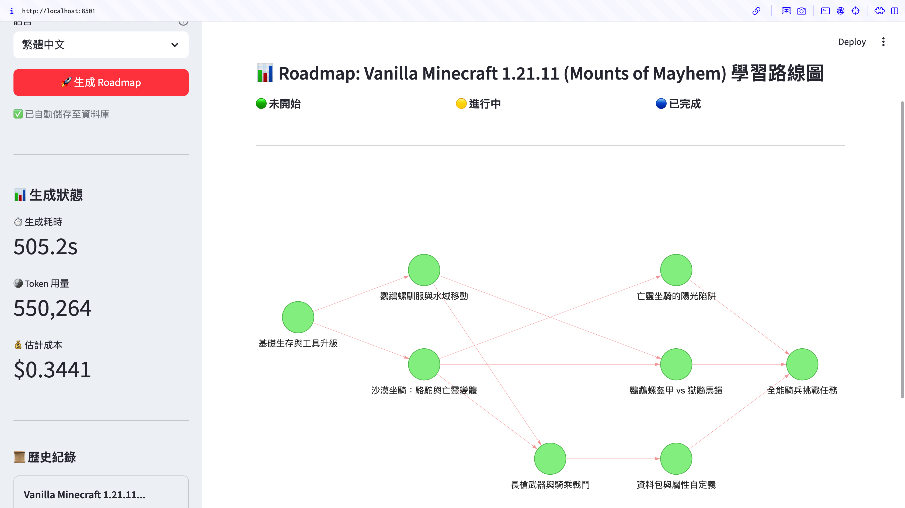
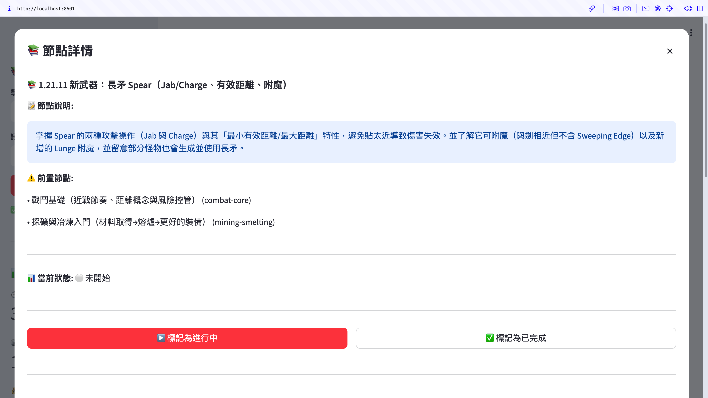
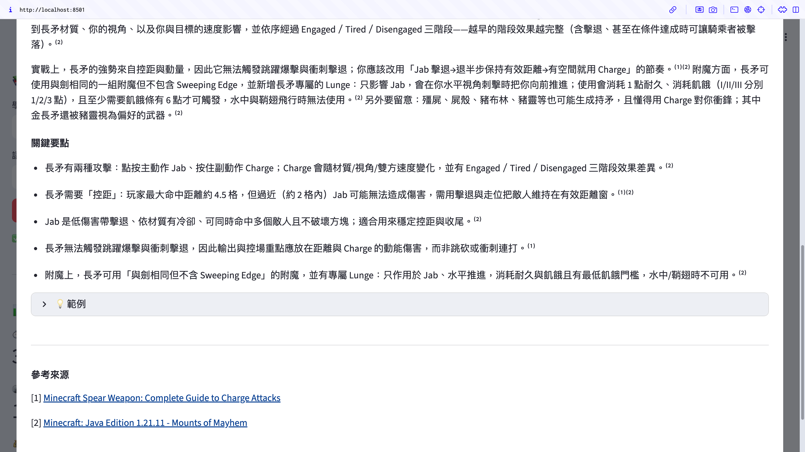

# CourseGen

**AI-Powered Learning Roadmap Generator** — A multi-agent system that generates structured learning roadmaps with pedagogical content, validated by critic models and a 3-layer evaluation pipeline.



## Features

- **Multi-Agent Workflow** — LangGraph orchestrates a two-phase pipeline: Phase 1 builds the DAG structure, Phase 2 generates content per node in topological order
- **Knowledge Search & Cleaning** — Tavily web search provides real-time knowledge; multi-stage LLM cleaning reduces noise before content generation
- **Critic & Smart Retry** — Dedicated critic models for each phase; conditional routing retries search or generation based on feedback
- **5 Node Types** — Prerequisite, Concept, Pitfall, Comparison, and Practice nodes cover different pedagogical purposes
- **3-Layer Evaluation** — Structural checks + multi-model LLM-as-Judge (3 cross-vendor models) + pipeline metrics for systematic quality assessment

## Architecture Overview



### Knowledge Search Pipeline



> Both roadmap and content phases use this pipeline. Content phase skips the final Knowledge Synthesis step (dashed); raw cleaned sources are passed directly to the content generator.

## Tech Stack

| Layer | Technology |
|---|---|
| Orchestration | LangGraph (stateful multi-agent workflow) |
| LLM Abstraction | LangChain + structured outputs via Pydantic |
| LLM Provider | OpenRouter (unified access to Claude, GPT, Gemini) |
| Web Search | Tavily API (advanced depth, raw markdown) |
| Data Validation | Pydantic v2 |
| Web UI | Streamlit + streamlit-agraph (DAG visualization) |
| Database | SQLAlchemy 2.0 + SQLite |
| Evaluation | Multi-model LLM-as-Judge + structural validation |
| Observability | Langfuse (tracing & monitoring) |
| Package Manager | uv + hatchling |

## Quick Start

### Prerequisites

- Python 3.12+
- [uv](https://docs.astral.sh/uv/) package manager
- OpenRouter API key ([openrouter.ai](https://openrouter.ai))
- Tavily API key (optional, for knowledge search — [tavily.com](https://tavily.com))

### Installation

```bash
# Clone the repository
git clone <repo-url>
cd CourseGen

# Install dependencies
uv sync

# Configure environment variables
cp .env.example .env
# Edit .env with your API keys (at minimum: OPENROUTER_API_KEY)
```

### Run

```bash
uv run streamlit run src/coursegen/ui/app.py
```

## Usage

1. **Enter a topic** — e.g. "Learn React hooks", "Python data science"
2. **Select preferences** — language (繁體中文 / English)
3. **Generate** — the system runs the two-phase workflow with a streaming progress bar (~30–60 seconds)
4. **Explore the roadmap** — click nodes on the DAG to view generated content in a detail dialog
5. **Track progress** — mark nodes as in-progress or completed
6. **Browse history** — generations are auto-saved to the database; reload or delete them from the sidebar

## Screenshots

| Roadmap DAG | Node Detail | Node Content & Citations |
|:---:|:---:|:---:|
|  |  |  |

## 5 Node Types

| Type | Purpose | Content Structure |
|---|---|---|
| **Prerequisite** | Diagnose and fill prior knowledge gaps | `overview`, `checklist` (self-assessment questions), `remediation` (resources for gaps) |
| **Concept** | Build correct mental models through deep explanation | `explanation` (300–600 words), `key_points`, `examples` (with code snippets) |
| **Pitfall** | Warn about common mistakes and debugging traps | `pitfalls` (❌→💡→✅ format), `warning_signs` (symptom → cause) |
| **Comparison** | Clarify confusion between similar concepts/tools | `subject_a`, `subject_b`, `comparison_table` (dimension × A vs B), `when_to_use` |
| **Practice** | Consolidate learning with hands-on tasks | `objective`, `tasks` (progressive subtasks), `expected_output`, `hints` |

## Evaluation

CourseGen includes a 3-layer evaluation pipeline in `src/coursegen/eval/`:

1. **Pipeline Metrics** — Aggregate statistics: roadmap first-pass rate, content success rate, avg generation time, token usage, cost, content cleaning reduction
2. **Structural Checks** — Deterministic validation of roadmap DAG properties (acyclicity, connectivity, dependency validity) and content schema completeness
3. **LLM-as-Judge** — 3 cross-vendor judge models score each generation on 5 dimensions:
   - **accuracy** — factual correctness verified against cited sources
   - **completeness** — coverage of core topic knowledge
   - **structure** — learning path ordering and dependency design
   - **practicality** — actionable examples and hands-on applicability
   - **citation** — proper attribution of factual claims to sources

### Running Evaluations

```bash
# Full evaluation (all 3 layers)
uv run python -m coursegen.eval.run_eval

# Single generation
uv run python -m coursegen.eval.run_eval --id <record_id>

# Skip LLM judge (Layer 1+2 only, no API cost)
uv run python -m coursegen.eval.run_eval --no-llm-judge

# List all generation records
uv run python -m coursegen.eval.run_eval --list
```

### Sample Results

Results from a single evaluation run (2026-03-03, generation model: GPT-5.2, topic: "Vanilla Minecraft 1.21.11"):

**Pipeline Metrics**

| Metric | Value |
|---|---|
| Roadmap first-pass rate | 100% |
| Content success rate | 100% (15/15 nodes) |
| Content cleaning reduction | 86% (5.6M → 787K chars) |
| Structural checks | 88/92 passed (95.7%) |

**LLM Judge Scores (1–5 scale)**

| Dimension | Claude Sonnet 4.6 | GPT-5.2 | Gemini 3.1 Pro | Mean |
|---|---|---|---|---|
| Accuracy | 4 | 4 | 5 | 4.3 |
| Completeness | 4 | 3 | 5 | 4.0 |
| Structure | 4 | 4 | 5 | 4.3 |
| Practicality | 4 | 4 | 5 | 4.3 |
| Citation | 4 | 3 | 5 | 4.0 |
| **Overall** | **4.0** | **3.6** | **5.0** | **4.2** |

## Project Structure

```
CourseGen/
├── src/coursegen/
│   ├── agents/                 # LangGraph node functions
│   │   ├── knowledge_search.py # Tavily search + LLM synthesis
│   │   ├── roadmap.py          # Roadmap generation agent
│   │   ├── critic.py           # Roadmap critic (single model)
│   │   └── content.py          # Content planning, generation, critic, router
│   ├── prompts/                # LLM prompt templates
│   │   ├── roadmap.py          # Roadmap generation & critic prompts
│   │   ├── content.py          # 5 type-specific content + critic prompts
│   │   ├── knowledge_synthesis.py
│   │   └── examine.py
│   ├── eval/                   # 3-layer evaluation pipeline
│   │   ├── run_eval.py         # CLI entry point
│   │   ├── llm_judge.py        # Multi-model LLM-as-Judge (Layer 3)
│   │   ├── structural_checks.py # Deterministic DAG & content checks (Layer 2)
│   │   ├── pipeline_metrics.py # Aggregate statistics (Layer 1)
│   │   └── schemas.py          # Evaluation result models
│   ├── schemas.py              # Pydantic models, enums, LangGraph State
│   ├── workflows/
│   │   └── basic.py            # LangGraph workflow definition (nodes, edges, conditionals)
│   ├── db/                     # Persistence layer
│   │   ├── database.py         # SQLAlchemy engine & session management
│   │   ├── models.py           # GenerationRecord ORM model
│   │   └── crud.py             # Save / list / load / delete operations
│   ├── ui/                     # Streamlit web interface
│   │   ├── app.py              # Main app (streaming generation + layout)
│   │   ├── components/
│   │   │   ├── preferences_form.py     # Topic & language form
│   │   │   ├── roadmap_visualizer.py   # Interactive DAG (streamlit-agraph)
│   │   │   ├── node_detail.py          # Node detail dialog overlay
│   │   │   ├── content_renderer.py     # 5 type-specific content renderers
│   │   │   └── history_sidebar.py      # Database history browser
│   │   └── utils/
│   │       ├── session_state.py        # Streamlit state init & reset
│   │       └── cost_tracker.py         # LLM cost tracking callback
│   └── utils/
│       ├── tavily_search.py
│       └── content_cleaner.py          # Multi-stage search content cleaning (~86% reduction)
├── data/                       # SQLite database & eval results (auto-created)
├── notebook/                   # Jupyter notebooks for testing
├── pyproject.toml
├── uv.lock
└── .env.example
```

## Environment Variables

```bash
# Required
OPENROUTER_API_KEY=sk-or-v1-...
BASE_URL=https://openrouter.ai/api/v1

# Generation models (defaults shown)
MODEL_NAME=openai/gpt-5.2
CONTENT_MODEL=openai/gpt-5.2
CHEAP_MODEL=google/gemini-3-flash-preview

# Critic models
ROADMAP_CRITIC_MODEL=openai/gpt-5.2
CONTENT_CRITIC_MODEL=openai/gpt-5.2

# Workflow parameters
MAX_ITERATIONS=5               # Max roadmap generation retries
CONTENT_MAX_RETRIES=5          # Max content retries per node

# Evaluation judge models (defaults shown)
JUDGE_MODEL_1=anthropic/claude-sonnet-4.6
JUDGE_MODEL_2=openai/gpt-5.2
JUDGE_MODEL_3=google/gemini-3.1-pro-preview

# Optional: Tavily web search
TAVILY_KEY=tvly-...

# Optional: Langfuse observability
LANGFUSE_PUBLIC_KEY=pk-lf-...
LANGFUSE_SECRET_KEY=sk-lf-...
LANGFUSE_HOST=https://cloud.langfuse.com

# Optional: Database (defaults to sqlite:///data/coursegen.db)
DATABASE_URL=sqlite:///data/coursegen.db
```

## License

MIT
