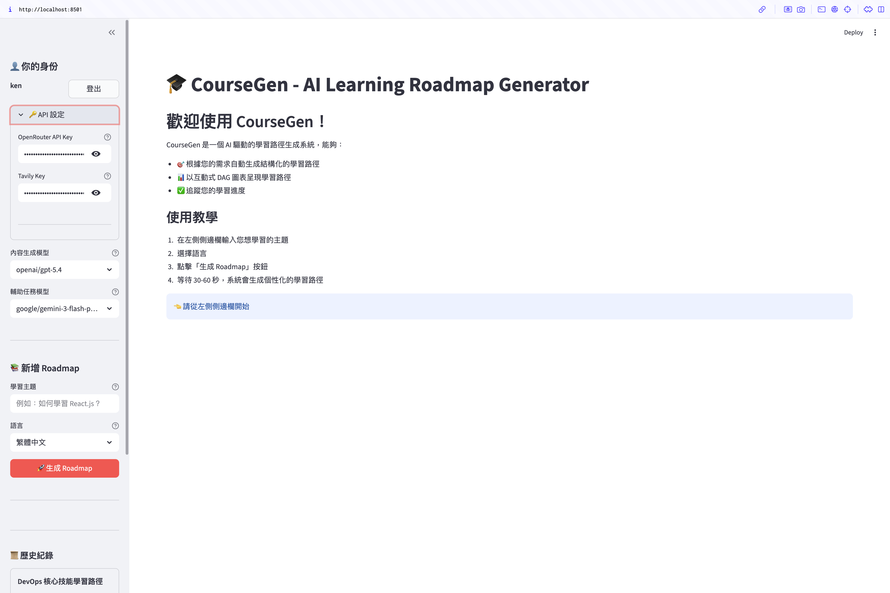
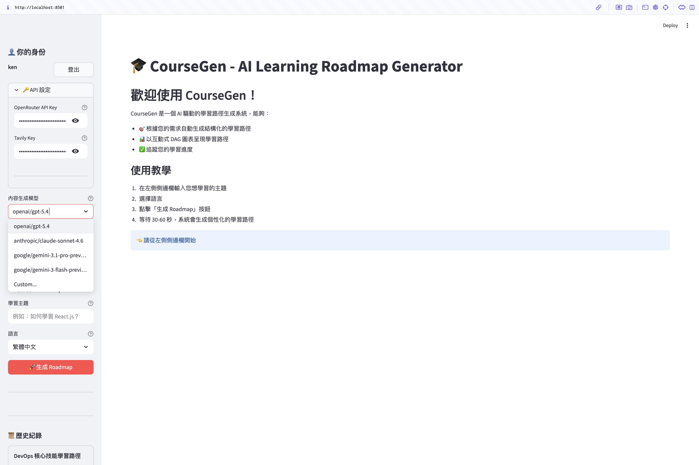

# Phase 1：使用者自填憑證與模型選擇
- 狀態：completed
- 期間：2026-05-15
- 證明：PR #1、commit `1259d55`

## 背景
CourseGen 原為單機 demo，API key 與模型寫在 server 端 `.env`，狀態存 `st.session_state`，無使用者隔離。要對外 self-host，須先把使用者敏感資料與身份從 server config 解耦，server 才能成為無狀態、可重啟的容器。Phase 1 是此解耦的第一步。

## 計劃
1. API key（OpenRouter / Tavily）與模型選擇移到 Sidebar 表單、存瀏覽器 localStorage —— 機密不寫 server，降低被駭時的代管責任、使 server 維持無狀態，並把 API 成本轉由使用者自己的額度承擔。
2. 新增暱稱欄位作為使用者識別 —— 不導入完整帳號系統，以最輕量的匿名身份供跨工作階段辨識。
3. 模型選擇收斂為兩個使用者面板（內容生成 / 輔助任務）—— 內部 6 個 model slot 對使用者是雜訊；按「用途」分類，使用者才知道每個選擇影響什麼。
4. 移除 `pyproject.toml` 早期實驗遺留的未用依賴 —— 縮小 image、加快部署、減少攻擊面。

## 驗證
無。

## 成果
**Sidebar 憑證與身份設定**

**內容生成 / 輔助任務模型選擇**

