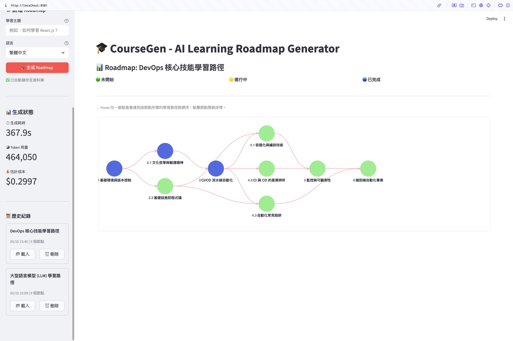

# Phase 2：user_id 資料隔離與範例 seed
- 狀態：completed
- 期間：2026-05-15
- 證明：PR #2、commit `5de07cc`

## 背景
承 Phase 1（憑證與身份已從 server config 解耦），Phase 2 處理資料層。原本 generation_records 沒有 user_id，所有使用者共用同一張表、彼此看得到對方的 roadmap。同時希望全新部署開箱即有範例內容，不必為每個環境跑一次性搬遷。

## 計劃
1. generation_records 加 user_id 欄位（String(64)、NOT NULL、indexed）—— 讓多使用者共用同一部署而不互相看到資料，寫入一律強制有 owner。
2. crud 四個函式改 keyword-only、user_id 無 default —— `= None` 會造成「忘了傳就默默看到全部」的靜默權限放大；強制顯式傳，每個呼叫端都得決定「我要看誰的」。
3. 三筆精選 roadmap 匯出成 JSON seed、由 init_db() idempotent 植入 example 使用者 —— 以 seed 取代一次性搬遷腳本，任何新環境或 docker image 開箱即有 demo，不依賴外部步驟。
4. 切換到本機 Postgres，並把 psycopg2-binary 正式登記進 pyproject —— 原 .env 指向看似 prod 的遠端 PG，開發應走獨立的本機 DB；psycopg2 先前未登記是技術債，一併補上。

## 驗證
無。

## 成果
**歷史側欄（含三筆 example 範例 roadmap）**

