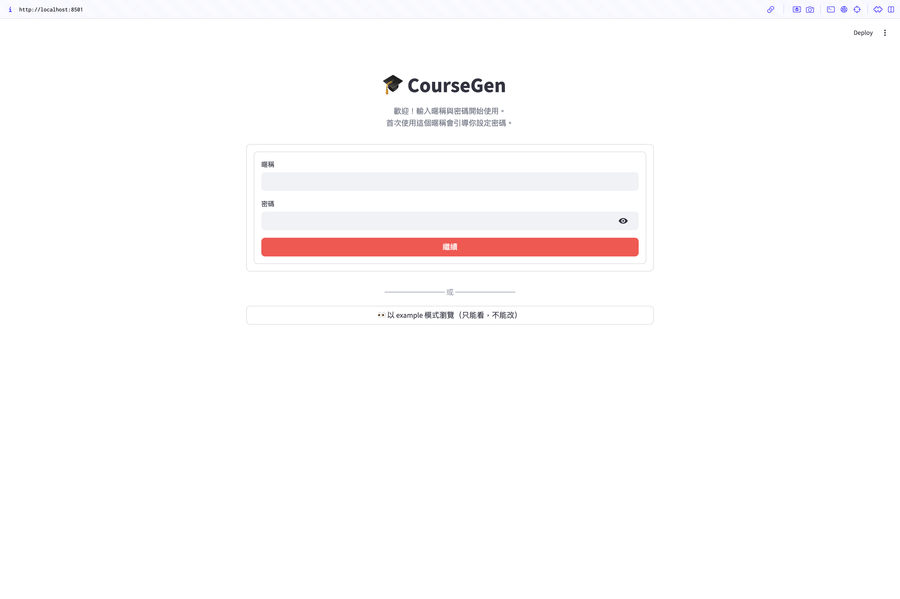
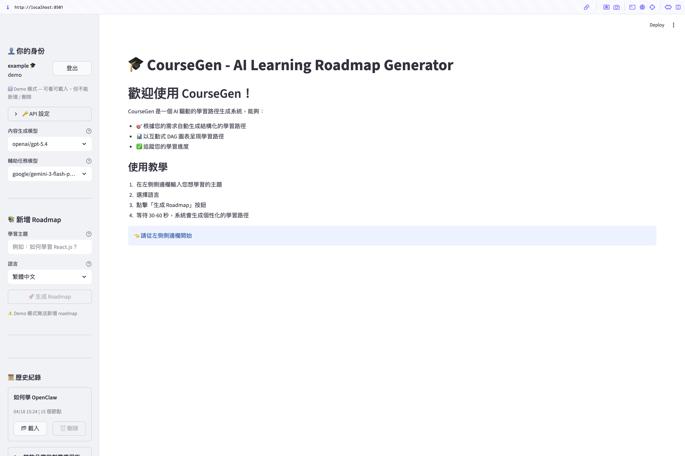

# Phase 2.5：密碼驗證與公開 demo
- 狀態：completed
- 期間：2026-05-15
- 證明：PR #3、commit `aabbcc4`

## 背景
Phase 2 後使用者識別仍是 honor-system：打別人的暱稱就能看到對方資料，沒有任何密碼驗證。Phase 2.5 要在暱稱之上加真正的登入閘，並讓 example 成為公開唯讀的展示帳號。

## 計劃
1. 加 bcrypt 與 users / user_sessions 兩張表，以 entry-gate 登入畫面取代 honor-system —— 一次登入即全開（不分讀寫），擋掉「打別人暱稱就看到資料」的洞，且比 OAuth 簡單得多。
2. 首次使用的暱稱走兩步確認自動註冊，既有暱稱驗 bcrypt 密碼 —— 免獨立註冊頁，降低登入摩擦。
3. session token（secrets.token_urlsafe）存 user_sessions、30 天 TTL，並透過 localStorage 持久化 —— 回訪者免再登入，沿用 Phase 1 的 localStorage 機制。
4. example 設為公開唯讀：專屬按鈕免登入旁路、前端按鈕 disabled、後端對 user_id=="example" 的寫入拋 PermissionError —— 雙保險，UI 改壞或被跨 UI 呼叫都擋得住。

## 驗證
無。

## 成果
**登入閘**

**example 公開唯讀 demo**

